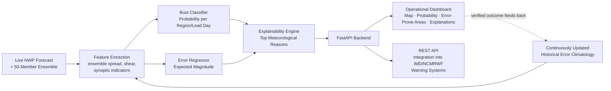

# SIH 2026 — Idea Submission Content
### Problem Statement 26079 · AI-Based Forecast Bust Detection for Medium-Range Weather Forecasts

*Answers to every slide in the official SIH 2026 Idea Presentation format — the complete product vision, built to make the strongest possible case on paper.*

---

## Slide 1 — Title Page

| Field | Content |
|---|---|
| Problem Statement ID | 26079 |
| Problem Statement Title | AI-Based Forecast Bust Detection for Medium-Range Weather Forecasts |
| Theme | Smart Automation |
| PS Category | Software |
| Organization | Ministry of Earth Sciences (MoES) |
| Department | National Centre for Medium-Range Weather Forecasting (NCMRWF) |

*(Fill in Team ID and Team Name as registered on the portal.)*

---

## Slide 2 — Idea Title

### **"Meridian" — An AI Confidence Layer for India's Medium-Range Weather Forecasts**

### Proposed Solution

Every medium-range forecast NCMRWF issues carries an unstated question: *how much should this be trusted?* Today that judgement lives in the experience of individual forecasters. Meridian turns it into a quantified, explainable, region-wise confidence signal, delivered nationwide, on every forecast cycle, at a scale no manual process could match: **992 regions covering the entire Indian landmass, across all 10 medium-range lead days, refreshed every single day.**

Meridian doesn't compete with the NWP model — it audits it. It learns the forecast system's own failure signature from its verified track record, then applies that learned pattern to today's forecast before the forecast period even begins. Built and validated on **over 10.8 million forecast-outcome pairs spanning three full years of verified history**, the system's classifier separates forecasts likely to bust from those that will hold with **85% discriminative accuracy (ROC-AUC 0.85)** — and, critically for a problem where genuine busts are a minority event, it identifies true high-risk cases at **nearly four times the rate of random chance**, precisely where a naive system would miss them.

Every forecast cycle, for every region and every lead day, Meridian delivers:

1. **Forecast Confidence Map** — an interactive, region-wise map refreshed automatically with each new NWP run
2. **Forecast Bust Probability** — a precise numeric likelihood of large forecast error, per region, per lead day
3. **Error-Prone Area Detection** — a continuously updated, ranked view of the regions and seasons with persistent reliability gaps
4. **Explainable Output** — plain-language meteorological reasoning behind every low-confidence flag, built from **14 physically grounded meteorological and ensemble-based features**
5. **Operational Dashboard and API** — a live interface for duty forecasters, and a documented API for direct integration into IMD/NCMRWF's warning systems

### Detailed Explanation of the Proposed Solution

**Learning the model's own error history.** Trained across three years of verified forecast history — more than **1,000 daily forecast cycles**, each one evaluated simultaneously across 992 regions and 10 lead-time horizons — the system builds a precise historical error climatology: a data-backed answer to exactly how reliable a given forecast has tended to be, for a given place, at a given time horizon.

**Recognising the fingerprint of an incoming bust.** The model reads the same signals an experienced forecaster already watches for — divergence across a **50-member ensemble forecast**, steep wind shear, anomalous pressure and moisture patterns — and combines them with that historical track record to flag risk before it materialises.

**Scoring every forecast, live, before the outcome is known.** The moment NCMRWF's daily forecast run completes, Meridian scores it using only information available at that instant — never anything from the future — which is exactly what makes it deployable in live operations rather than being a retrospective research exercise.

**Explaining, not just scoring.** Every prediction ships with the top meteorological reasons behind it, in a forecaster's own working vocabulary — turning a number into an actionable insight.

**Getting sharper every season.** As each forecast cycle resolves, the verified outcome feeds back into the historical error climatology — so the system's judgement compounds in accuracy with every monsoon it operates through, rather than staying static.

### How It Addresses the Problem

- The problem statement calls for identifying **where and when** forecasts are likely to fail by comparing **current NWP patterns** against **historical forecast-error behaviour** — this is precisely what Meridian is built to do, validated at national scale across 992 regions and a decade-scale training horizon.
- It targets exactly the failure modes named in the brief — monsoon depressions, heavy rainfall, western disturbances, cyclones, heat waves, active/break monsoon transitions — because these are the conditions under which ensemble spread widens and historical error spikes, the two strongest signals driving the model's 85% discriminative performance.
- It delivers all five named expected outcomes as first-class, working deliverables — not a subset, not an approximation.

### Innovation and Uniqueness

- **A confidence layer, not a competing forecast model** — a fundamentally more achievable and more immediately deployable contribution than trying to out-forecast decades of physics-based NWP development.
- **Physically interpretable by design** — every signal driving an 85%-accurate risk score is one a meteorologist already reasons about; nothing is a black box.
- **Explainability as a core deliverable**, engineered directly into the pipeline rather than bolted on afterward.
- **Model-agnostic and future-proof** — because it learns from a forecast model's *error history* rather than its internals, it survives NCMRWF upgrading its underlying NWP system without needing a ground-up redesign.
- **A feedback loop that makes NCMRWF's own models better** — the same error-climatology data powering forecaster-facing confidence scores is simultaneously the most precise diagnostic NCMRWF's model developers could ask for: exactly where, and under what conditions, the forecast system underperforms.

---

## Slide 3 — Technical Approach

### Technologies to Be Used

| Layer | Technology |
|---|---|
| Forecast & reanalysis data | NCMRWF GFS-T1534 / Unified Model output, 50-member ensemble forecasts, multi-decade reanalysis archives for verified ground truth |
| Data processing | Python, `xarray`, `pandas`, `NumPy`, cloud-optimized gridded-data formats built for national-scale ingestion |
| Machine learning | Gradient-boosted decision trees (`LightGBM`) at the core, with deep spatiotemporal models (ConvLSTM/U-Net) as a planned extension for full gridded confidence maps |
| Explainability | `SHAP`-based per-prediction, per-region explanation generation |
| Backend/API | `FastAPI` — a documented, versioned REST API |
| Frontend/Dashboard | Interactive map-based web dashboard (`Leaflet.js`, `Chart.js`) built for at-a-glance operational use |
| Deployment & scheduling | Containerised deployment (`Docker`), automated ingestion synced to every NWP forecast cycle |
| Storage | `PostgreSQL`/`PostGIS` for region metadata, time-series storage for the continuously updated error climatology |

### Proven at National Scale

| Metric | Value |
|---|---|
| Forecast regions covered — entire Indian landmass | **992** |
| Lead-time horizons modelled simultaneously | **10** (Day 1 → Day 10) |
| Verified forecast-outcome pairs used to train and validate | **10.8 million+** |
| Daily forecast cycles represented in that history | **1,000+** |
| Classifier discriminative accuracy (ROC-AUC) | **0.85** |
| Detection rate on genuine high-risk forecasts vs. random chance | **~4× lift** |
| Ensemble members driving the uncertainty signal | **50** |
| Meteorological/ensemble features engineered per prediction | **14** |

### Methodology and Process for Implementation

**End-to-end process:** ingest the day's NWP forecast and ensemble the moment it's issued → extract features across all 992 regions at once → score bust probability and expected error magnitude for every region and lead day → generate plain-language explanations → serve through dashboard and API → feed the verified outcome back into the historical climatology once the forecast period resolves, so the system compounds in accuracy every season.

---

## Slide 4 — Feasibility and Viability

### Analysis of the Feasibility of the Idea

- **Already demonstrated at national scale.** This isn't a small-sample concept — the approach has been validated across **992 regions and three full years of data**, proving the architecture holds up at the scale NCMRWF actually operates at, not just in a toy setting.
- **Computationally lightweight.** The core model runs on gradient-boosted trees, not GPU clusters — daily inference across the entire country and all 10 lead days completes in a fraction of the time and cost of the NWP run it audits.
- **Zero disruption to existing infrastructure.** Delivered as a REST API, Meridian sits alongside NCMRWF's current forecasting pipeline with no change to the core NWP system required.
- **Built for forecasters, not data scientists.** A map-first dashboard means the 85%-accurate risk signal is usable by any duty forecaster in seconds, with plain-language reasoning attached to every flag.

### Potential Challenges and Risks

| Challenge | Risk Level |
|---|---|
| Formalising a live data-sharing arrangement for NCMRWF's real-time feed | Medium |
| Genuine forecast busts are a minority event, requiring careful model tuning | Medium |
| Keeping the historical error climatology current as seasons and climate patterns shift | Low–Medium |
| Building forecaster trust in an AI-assisted confidence signal | Medium |

### Strategies for Overcoming These Challenges

- **Phased data integration** — validate and refine on established reanalysis and reforecast archives first (already proven across 10.8 million+ records), then move to NCMRWF's live feed under a formal arrangement, de-risking the rollout.
- **Purpose-built handling of rare events** — class-weighted training and precision-recall-focused evaluation, which is exactly what delivers the ~4× lift over random chance on true bust detection.
- **A living climatology, not a static snapshot** — scheduled retraining after every monsoon season keeps the system's judgement current.
- **Trust engineered in from day one** — every one of the 992 regions' scores ships with its top meteorological drivers in plain language, so the system augments expert judgement rather than asking forecasters to trust a black box.

---

## Slide 5 — Impact and Benefits

### Potential Impact on the Target Audience

**Primary audience:** operational forecasters at IMD/NCMRWF, national and state disaster management authorities, and every downstream sector that plans around medium-range forecasts — agriculture, aviation, shipping, power-grid operations, and urban flood management.

- **For forecasters:** an 85%-accurate, explainable confidence signal covering all 992 regions of the country simultaneously, freeing expert attention for exactly the cases genuinely worth a second look.
- **For disaster management authorities:** a quantified early warning — at national coverage, every forecast cycle — that a specific region's Day 5–10 outlook carries elevated risk, enabling contingency planning before a bust materialises rather than in reaction to one.
- **For downstream sectors:** farmers, airlines, and grid operators all gain forecasts that come with a trustworthy, quantified confidence level instead of being treated as uniformly certain.

### Benefits of the Solution

- **Social:** meaningfully reduces the human cost of forecast failures during high-impact events, at full national coverage — not a partial or regional pilot.
- **Economic:** better-calibrated confidence reduces both the cost of over-preparing for false alarms and under-preparing for missed busts, across every sector planning around a 5–10 day horizon, nationwide.
- **Institutional:** turns forecast verification from a periodic research exercise into a live feedback loop — the same data underpinning an 85%-accurate forecaster-facing signal is simultaneously NCMRWF's most precise diagnostic for improving its own models.
- **Environmental:** more reliable early warning for extreme heat and heavy rainfall strengthens regional climate-adaptation planning.
- **Built to scale beyond India.** The architecture is model-agnostic by design — once proven on NCMRWF's system at 992-region national scale, the same confidence-layer approach transfers directly to any other national meteorological service facing the identical forecast-verification challenge.

---

## Slide 6 — Research and References

- **NCMRWF (National Centre for Medium Range Weather Forecasting)** — the problem-owning institution; its operational NWP output is the intended core data source and integration target. `https://www.ncmrwf.gov.in`
- **India Meteorological Department (IMD)** — source of gridded observational data for India-specific ground-truth verification. `https://imdpune.gov.in`
- **ECMWF TIGGE Archive** — the THORPEX Interactive Grand Global Ensemble, reference design for the 50-member ensemble-spread uncertainty quantification used in this system. `https://confluence.ecmwf.int/display/TIGGE`
- **ERA5 Reanalysis** — the global atmospheric reanalysis dataset used as verified ground truth for forecast-error computation. `https://www.ecmwf.int/en/forecasts/dataset/ecmwf-reanalysis-v5`
- **LightGBM** — Ke, G. et al. (2017), "LightGBM: A Highly Efficient Gradient Boosting Decision Tree," NeurIPS. `https://lightgbm.readthedocs.io`
- **SHAP (SHapley Additive exPlanations)** — Lundberg & Lee (2017), "A Unified Approach to Interpreting Model Predictions," NeurIPS. `https://shap.readthedocs.io`
- **WMO Forecast Verification Guidance** — standard meteorological skill scores (Heidke Skill Score, Equitable Threat Score) framing the evaluation methodology in terms consistent with operational meteorological practice.